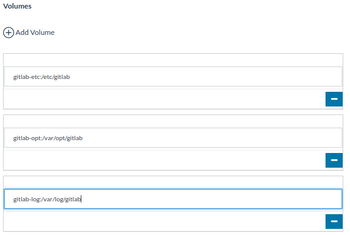

# Ambiente de Integración Continua

Este proyecto busca orientar sobre cómo crear un ambiente de integración continua usando [Rancher](https://rancher.com/), [Gitlab](https://about.gitlab.com/) y [Prometheus](https://prometheus.io/).

## 1. Creación de rancher

  Para crear un ambiente funcional de [Rancher](https://rancher.com/) usando [Vagrant](https://vagrantup.com) siga este [**tutorial**](https://github.com/tutmosisII/vagrant_rancher)

## 2. Gitlab

En su útimas versiones este proyecto se ha convertido en un poderoso motor de Integración continua (CI) que contiene las siguientes herramientas.
  * [Docker](https://www.docker.com/) Registry
  * [Prometheus](https://prometheus.io/) para monitoreo
  * [Mattermost](https://mattermost.com/) Para Comunicación entre equipos.
  * API para integración con terceros.

### 2.1 Desplegando Gitlab por medio de Rancher.

Para iniciar vaya a la cerpeta [node_gitlab](node_gitlab) y ejecute el siguiente comando:

    vagrant up

Cuando el nodo este arriba agregeló a Rancher siguiendo los pasos indicados en [**tutorial rancher**](https://github.com/tutmosisII/vagrant_rancher)

Para ingresar el nodeo por ssh use este comando:

    vagrant ssh gitlab

Gitlab usa la ip 192.168.1.102.Pegue el comando obtenido de Rancher.

Ahora Rancher en la sección de Host debería verse así:

#### 2.1.1 Desplegando Gitlab

>Cree un stack llamado gitlab.
>
Adicione un servicio al stack llamelo gitlab
>
Image: gitlab/gitlab-ce:latest
>
Volumes:
>
gitlab-etc:/etc/gitlab
>
gitlab-opt:/var/opt/gitlab
>
gitlab-log:/var/log/gitlab
>
Networking
>
Configure el nombre del host: git
>
Health Check
>
HTTP: Port 80
Path: GET /HTTP/1.0
>
Add a sidekick to the service called postfix
>
Image: tozd/postfix
>
Environment:
>
MY_NETWORKS:10.42.0.0/16, 127.0.0.0/8
>
ROOT_ALIAS: you@yourdomain.com
>
Volumes:
postfix-log:/var/log/postfix
>
postfix-spool:/var/spool/postfix
>
Health Check:
TCP: Port 25

Lo mismo, pero en imágenes:

## Requerimientos

Rancher: 1GB

Gitlab:  4GB, 2 cup

## Referencias

Buena parte de esta documetación esta basada en:
https://rancher.com/how-to-run-gitlab-in-rancher-1/
